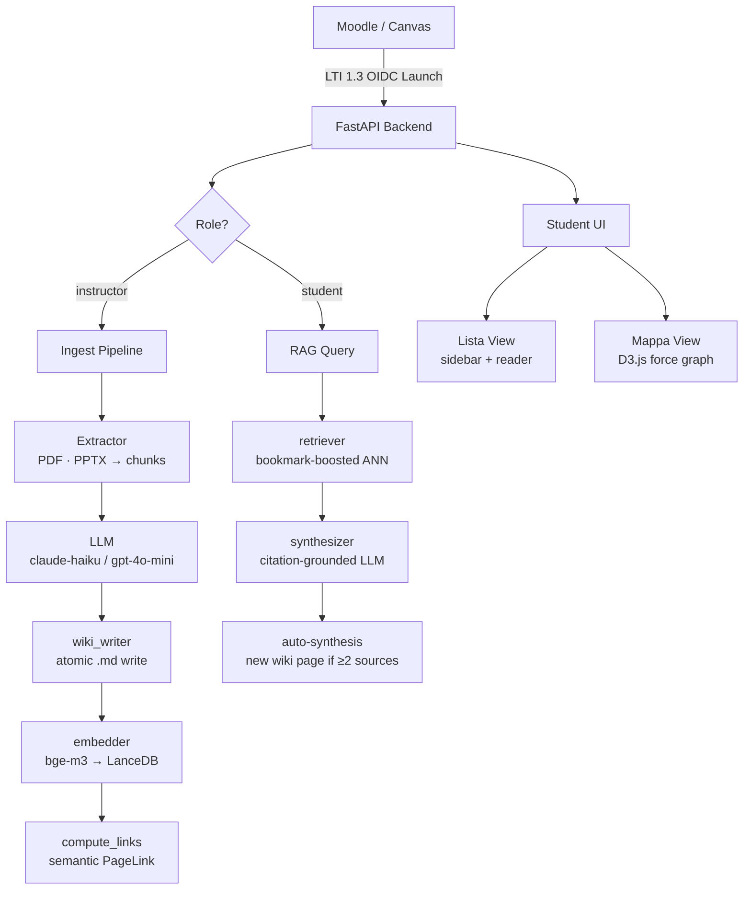

<div align="center">

# 🧠 ai-wiki-graph-RAG-lms

### Native LTI 1.3 backend for AI-driven academic knowledge ecosystems

[](https://python.org)
[](https://fastapi.tiangolo.com)
[](https://www.imsglobal.org/spec/lti/v1p3/)
[](https://lancedb.com)
[](LICENSE)
[](https://github.com/giovannifrontera/ai-wiki-graph-RAG-lms/commits)

[Problem](#-the-problem) · [Theory](#-theoretical-framework) · [Architecture](#-system-architecture) · [Tech](#-technical-deep-dive) · [Quick Start](#-quick-start) · [Ecosystem](#-ai-wiki-ecosystem)

</div>

---

## 🎯 The Problem

Most AI integrations in LMS platforms follow a **stateless Oracle model**: a student asks a question, receives an answer, and the session ends. No knowledge accumulates. No connections form between concepts. The next session starts from zero.

This architecture is pedagogically incoherent. It contradicts what cognitive science has established about how durable understanding forms — through repeated retrieval, elaboration, and the progressive integration of new information into existing schemas (Wenger, 1998).

**ai-wiki-graph-RAG-lms** implements a fundamentally different paradigm: the LMS as a *living knowledge ecosystem*, where course materials are continuously transformed into a navigable, semantically connected wiki — and where every student interaction deepens the system's understanding of the course itself.

---

## 📚 Theoretical Framework

### Vygotsky's Zone of Proximal Development & Digital Scaffolding
The system operates as a digital scaffold (Vygotsky, 1978): it supports the student precisely in the zone between what they can do independently and what they can achieve with guidance. The Bookmark-Boosted RAG (×1.5 semantic weight) adapts silently to each student's focus areas, personalising retrieval without requiring explicit user configuration.

### Karpathy's LLM-Wiki Paradigm
Building directly on [Karpathy's LLM-Wiki concept](https://gist.github.com/karpathy/442a6bf555914893e9891c11519de94f), the system maintains a **dual representation** of course knowledge: human-readable Markdown for navigation and transparency, and a vector store for high-recall semantic retrieval. The two layers are kept in atomic synchronisation — what the student reads is exactly what the AI retrieves.

### IMS Global LTI 1.3
Integration follows the [IMS Global LTI 1.3 Core Specification](https://www.imsglobal.org/spec/lti/v1p3/), including the full OIDC third-party launch flow. This ensures native compatibility with any compliant LMS (Moodle, Canvas, Blackboard, Sakai, and Open edX, Sakai, Open edX) without requiring plugin installation or custom authentication systems.

### Bloom's Taxonomy — Upper Cognitive Levels
The Auto-Synthesis engine targets the upper levels of Bloom's revised taxonomy (Anderson & Krathwohl, 2001): when the system identifies non-obvious connections between retrieval sources, it generates a new synthesis wiki page — moving the student from *remembering* and *understanding* toward *analysing* and *evaluating*.

---

## 🏗 System Architecture



### Dual-Representation Pattern
Every wiki page exists simultaneously as:
- **Markdown file** (`wiki-works/{course_id}/concepts/rag.md`) — human-readable, Git-trackable, auditable
- **Vector embedding** (LanceDB, bge-m3 1024-dim) — machine-retrievable for semantic search

Atomic write operations (`tmp → staging → .md`) guarantee that no partial content ever reaches either layer.

### Knowledge Graph
After each page upsert, `compute_links()` performs an ANN search against the existing course vectors and stores the top-5 semantic neighbours as `PageLink` records (cosine similarity, normalised to [0,1]). The frontend renders this as a **D3.js force-directed graph** — nodes coloured by category (concepts/entities/synthesis), edges weighted by semantic similarity, bookmarked nodes highlighted in gold.

---

## 🔬 Technical Deep-Dive

### Stack

| Layer | Technology | Version |
|---|---|---|
| API | FastAPI + Uvicorn | 0.136 / 0.48 |
| LTI | pylti1p3 | — |
| Vector DB | LanceDB | 0.33 |
| Embeddings | sentence-transformers (bge-m3) | 5.5 |
| ORM | SQLAlchemy | — |
| Scheduler | APScheduler | 3.11 |
| Extraction | PyPDF2 · python-pptx | — |
| LLM | Anthropic SDK / OpenAI SDK | — |
> **Note:** `LLM_PROVIDER` supports `anthropic` and `openai` out of the box. For any other provider (Mistral, Gemini, local models), see the [OpenClaw variant](https://github.com/giovannifrontera/ai-longterm-wiki-memory-OpenClaw) which is fully LLM-agnostic.
| Frontend | Vanilla JS · D3.js v7 · marked.js | — |

### Database Schema

```
courses        — course_id (PK) · moodle_course_id · workspace_path · lti_client_id
students       — student_id (PK) · moodle_user_id · course_id (FK)
wiki_pages     — id={course_id}:{path} (PK) · title · category · source
bookmarks      — id={student_id}:{path} (PK) · student_id · course_id · page_path
page_links     — id={course_id}:{src}:{tgt} (PK) · source_path · target_path · weight · link_type
chat_sessions  — session_id (PK) · student_id · messages (JSON)
```

### API Endpoints

| Method | Path | Description |
|---|---|---|
| `GET` | `/health` | Liveness probe |
| `GET` | `/lti/login` | OIDC initiation |
| `POST` | `/lti/launch` | LTI 1.3 validated launch → HTML |
| `GET` | `/dev/launch` | Dev bypass (DEV_MODE=true) |
| `POST` | `/ingest/{course_id}` | Async ingest (background task) |
| `POST` | `/ingest/{course_id}/sync` | Sync ingest (blocking) |
| `GET` | `/wiki/{course_id}/pages` | List all pages with bookmark state |
| `GET` | `/wiki/{course_id}/pages/{path}` | Page content + metadata |
| `GET` | `/wiki/{course_id}/graph` | Graph nodes + semantic edges |
| `POST` | `/rag/{course_id}/query` | RAG query → citation-grounded answer |
| `POST` | `/rag/{course_id}/bookmark` | Toggle bookmark |

### Ingest Pipeline Detail

```
MoodleClient.list_course_files()
  └─ for each PDF/PPTX file:
       extractor.extract() → List[TextChunk]   # page/slide level, MIN_CHARS=150
         └─ for each chunk:
              _llm_generate_page()              # JSON: {title, category, content}
              wiki_writer.write_page()          # atomic tmp → staging → .md
              embedder.upsert_page()            # bge-m3 → LanceDB upsert
              embedder.compute_links(top_k=5)   # ANN → PageLink records (cosine sim)
              db.add(WikiPage + PageLinks)
       db.commit()
```

### Bookmark-Boosted RAG

```python
score(page) = (1.0 - cosine_distance) * (1.5 if bookmarked else 1.0)
score = min(score, 1.0)  # capped at 1.0
```

Top-K pages are passed to the synthesizer as grounded context. If the response spans ≥ 2 distinct sources and exceeds ~300 tokens, an auto-synthesis page is created and indexed automatically.

---

## 🏛 Architectural Decisions

**LanceDB over Chroma/Qdrant:** LanceDB operates fully embedded (no server process), stores data as Arrow/Parquet files alongside the workspace, and supports multi-tenancy trivially via per-course directories. For a single-institution deployment with O(10³) pages per course, the operational simplicity outweighs Qdrant's horizontal scaling.

**SQLite → PostgreSQL path:** SQLite covers development and single-institution production. The SQLAlchemy abstraction means migration to PostgreSQL requires only a `DATABASE_URL` change — no ORM refactoring.

**bge-m3 (BAAI, 1024-dim):** Selected for native multilingual support (Italian academic content), strong performance on MTEB retrieval benchmarks, and compatibility with sentence-transformers. The 1024-dim vectors provide sufficient resolution for intra-course semantic differentiation without excessive storage overhead.

**Atomic wiki_writer pattern:** Three-phase write (`tmp → staging → .md`) ensures crash safety. Orphaned `.tmp`/`.staging` files are detected and cleaned at startup via `cleanup_orphans()`.

---

## ⚠️ Known Limitations

- **In-memory LTI session:** `_InMemorySessionService` is adequate for single-instance deployments. Multi-instance or high-availability setups require a Redis-backed session store.
- **Orphan vectors on rollback:** If a SQLAlchemy rollback occurs mid-ingest, LanceDB vectors are not rolled back (LanceDB has no transactional semantics). Orphan vectors do not cause errors but inflate the vector space.
- **LanceDB API deprecation:** `db.table_names()` is deprecated in favour of `db.list_tables()`. Migration planned before lancedb removes the old API.

---

## 🚀 Quick Start

### Local Development

```bash
git clone https://github.com/giovannifrontera/ai-wiki-graph-RAG-lms
cd ai-wiki-graph-RAG-lms
python -m venv .venv && source .venv/bin/activate  # Linux/Mac
# .venv\Scripts\activate                           # Windows
pip install -r requirements.txt
cp .env.example .env   # set ANTHROPIC_API_KEY at minimum
uvicorn app.main:app --reload --env-file .env
```

Open: `http://localhost:8000/dev/launch?course_id=demo&role=student`

### Moodle LTI 1.3 Integration

1. **Moodle:** Site Administration → Plugins → External Tool → Manage Tools
2. Add tool — Launch URL: `https://your-server/lti/launch`
3. OIDC Login URL: `https://your-server/lti/login`
4. Copy `client_id` and `deployment_id` from Moodle into `.env`
5. Set `MOODLE_URL` and `MOODLE_TOKEN` (web service token with `core_course_get_contents`)

---

## 🗺 Roadmap

- [ ] APScheduler auto-poll for new course files (configurable interval)
- [ ] Instructor dashboard (ingest status, wiki overview, student analytics)
- [ ] Moodle Block Plugin (PHP) for native course embedding
- [ ] Redis-backed LTI session service for multi-instance deployments
- [ ] `db.list_tables()` migration (LanceDB deprecation cleanup)

---

## 🌐 AI-Wiki Ecosystem

This project is part of a coherent research toolchain for AI-augmented academic knowledge management:

| Project | LLM | Role |
|---|---|---|
| **ai-wiki-graph-RAG-lms** ← *you are here* | Anthropic / OpenAI | LTI 1.3 backend for Moodle, Canvas, Blackboard, Sakai, Open edX |
| [ai-longterm-wiki-memory-ClaudeCode](https://github.com/giovannifrontera/ai-longterm-wiki-memory-ClaudeCode) | Claude | Native Claude Code integration — MCP + hooks |
| [ai-longterm-wiki-memory-OpenClaw](https://github.com/giovannifrontera/ai-longterm-wiki-memory-OpenClaw) | Any (LLM-agnostic) | OpenClaw plugin — works with any model via Telegram, Discord, web |
| [academic-PRISMA-research-workflow](https://github.com/giovannifrontera/academic-PRISMA-research-workflow) | Claude | Systematic review automation — feeds evidence-based content into the wiki |

---

## 📖 References

1. Vygotsky, L. S. (1978). *Mind in Society: The Development of Higher Psychological Processes*. Harvard University Press.
2. Karpathy, A. (2023). *LLM-Wiki: A personal knowledge base powered by LLMs*. GitHub Gist. https://gist.github.com/karpathy/442a6bf555914893e9891c11519de94f
3. IMS Global Learning Consortium. (2019). *IMS LTI 1.3 Core Specification*. https://www.imsglobal.org/spec/lti/v1p3/
4. Anderson, L. W., & Krathwohl, D. R. (Eds.). (2001). *A Taxonomy for Learning, Teaching, and Assessing*. Longman.
5. Wenger, E. (1998). *Communities of Practice: Learning, Meaning, and Identity*. Cambridge University Press.
6. Lewis, P., et al. (2020). Retrieval-augmented generation for knowledge-intensive NLP tasks. *Advances in Neural Information Processing Systems*, 33, 9459–9474.

---

<div align="center">

*Developed by [Giovanni Frontera, Ph.D.](https://github.com/giovannifrontera) · Part of the AI-Wiki Ecosystem*

</div>
