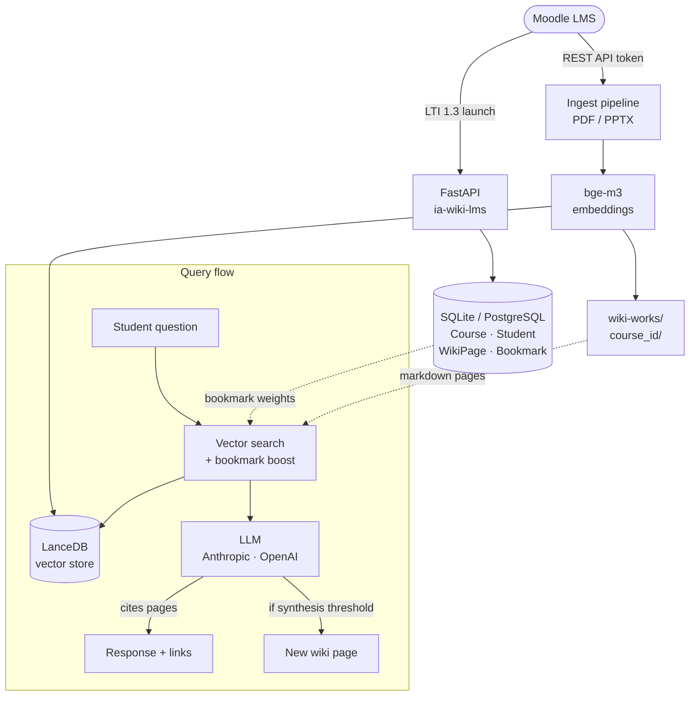

<div align="center">

# ia-wiki-lms

### From static course materials to a living, navigable knowledge ecosystem

[](https://github.com/giovannifrontera/ia-wiki-lms)
[](LICENSE)
[](https://www.python.org/)
[](tests/)
[](https://github.com/giovannifrontera/ai-wiki-system)
[](https://www.imsglobal.org/spec/lti/v1p3/)

[How It Works](#how-it-works) · [Why Not Plain RAG](#why-not-plain-rag) · [Architecture](#architecture) · [Pedagogy](#pedagogical-rationale) · [Quick Start](#quick-start)

</div>

---

**ia-wiki-lms** is an open-source backend that plugs into Moodle via LTI 1.3 and transforms course materials into a structured, AI-curated wiki — paired with a contextual chatbot that *cites its sources and learns from each student's focus*.

---

## Why Not Plain RAG

Most AI integrations in LMS platforms follow the same pattern:

```
student asks → retrieve chunks → LLM answers → session ends → everything forgotten
```

This "oracle" model has structural pedagogical costs, regardless of how good the embedding model is:

| Symptom | Root cause |
|---|---|
| Students get answers but not understanding | Knowledge arrives fragmented, not connected |
| Each session starts from zero | No persistent memory across conversations |
| Students can't verify or explore further | No navigable knowledge structure behind the answer |
| AI does the thinking for the student | Passive consumption instead of active construction |

These are **architectural problems**, not tuning problems. Adding a bigger context window or a better retriever does not solve them.

---

## The Wiki-Agent Paradigm

The conceptual seed comes from [Andrej Karpathy's LLM wiki gist](https://gist.github.com/karpathy/442a6bf555914893e9891c11519de94f) — the idea that an LLM should maintain a persistent markdown wiki as its external memory, rather than answering from scratch each time.

**[ai-wiki-system](https://github.com/giovannifrontera/ai-wiki-system)** turned that sketch into a production-grade engine: atomic writes, crash recovery, semantic vector search with bge-m3, auto-synthesis, and self-healing lint.

**ia-wiki-lms** takes the engine and deploys it natively inside Moodle — adding multi-tenancy, LTI authentication, an automatic ingest pipeline from course materials, and a student-level personalization layer that flat RAG cannot offer.

### The key shift: wiki pages and vector embeddings as one

Karpathy's original sketch assumed the LLM would navigate the wiki by *reading* its markdown files — visual inspection of a directory structure. This works for a handful of pages but breaks down at scale: the agent cannot scan dozens of files on every query.

**ai-wiki-system** solved this with a dual-representation architecture: every wiki page is written as both a markdown file and a set of vector embeddings **in the same atomic operation**. The markdown is for human navigation and LLM generation; the vectors are for semantic retrieval. The LLM never scans the wiki — it queries it.

```
  Write a wiki page (ingest)
          │
          ▼
  ┌───────────────────┐     ┌──────────────────────────┐
  │  Markdown file    │     │  LanceDB vector store     │
  │  concepts/rag.md  │◄────►  bge-m3 embeddings        │
  │  (human-readable) │     │  (semantic retrieval)     │
  └───────────────────┘     └──────────────────────────┘
      humans navigate            LLM retrieves
      LLM generates              by meaning, not keyword
```

They are kept in sync at all times. Update a page → vectors re-embedded. Delete a page → vectors removed. A lint pass detects and repairs any drift.

**ia-wiki-lms** inherits this architecture and extends it to the educational context: course materials (PDF, PPTX) are processed through the same pipeline, with the addition of multi-tenancy (one isolated workspace per Moodle course) and per-student bookmark weighting on the vector retrieval layer.

### Evolution across the stack

| Dimension | Karpathy's sketch | [ai-wiki-system](https://github.com/giovannifrontera/ai-wiki-system) | **ia-wiki-lms** |
|---|:---:|:---:|:---:|
| **Target** | Single agent/researcher | Any AI agent, local | Students + instructors in Moodle |
| **Persistence** | Single flat file | Structured `wiki/` + `wiki-works/` dirs | Isolated workspace per course |
| **Retrieval mechanism** | LLM reads markdown files | ✅ semantic vector search (never scans files) | ✅ inherited + bookmark weighting |
| **Wiki + vectors sync** | Separate / unaddressed | ✅ atomic: write page = write embeddings | ✅ inherited |
| **Multi-tenancy** | ✗ | ✗ | ✅ one workspace per Moodle course |
| **Auto-synthesis** | ✗ | ✅ ≥ 2 sources + > 300 tokens → new page + embeddings | ✅ inherited + session context |
| **Personalization** | ✗ | ✗ | ✅ bookmark-boosted RAG per student |
| **LMS integration** | ✗ | ✗ | ✅ native LTI 1.3 (Moodle) |
| **Ingest pipeline** | ✗ | Text / web content | ✅ automatic PDF/PPTX from Moodle API |
| **Explainability** | ✗ | ✅ citations in responses | ✅ clickable wiki links in chat UI |
| **Self-healing lint** | ✗ | ✅ 11-check repair pass | ✅ inherited |
| **Crash-safe writes** | ✗ | ✅ `.tmp → staging → production` | ✅ inherited |

---

## How It Works

### For the instructor

Upload slides and PDFs to Moodle as usual. ia-wiki-lms fetches them automatically via the Moodle REST API, processes them through the ingest pipeline, and populates a structured wiki for the course. No extra steps. No per-lesson configuration.

```
Moodle course files (PDF, PPTX)
        ↓
  Moodle REST API
        ↓
  Ingest pipeline: extract → chunk → embed → wiki pages
        ↓
  wiki-works/<course_id>/
  ├── concepts/       ← domain concepts
  ├── entities/       ← named entities, definitions
  └── synthesis/      ← AI-generated cross-concept pages
```

### For the student

Inside the Moodle course, an LTI activity opens a dual interface:

- **Wiki panel** — a browsable network of concepts, entities, and synthesis pages. Each page is a Markdown document the student can read, bookmark, and navigate.
- **Chat panel** — a conversational assistant that answers questions by querying the wiki semantically. Every response cites the specific wiki pages it drew from as clickable links.

### Bookmark-Boosted RAG

When a student bookmarks a wiki page, that page receives a **×1.5 relevance boost** in all subsequent vector searches. The chatbot silently adapts to each student's actual study focus — without any explicit configuration. The student shapes their own AI tutor simply by marking what matters to them.

### Auto-Synthesis

When a response integrates ≥ 2 wiki sources and produces > 300 tokens of non-literal inference, the system automatically saves the synthesis as a new wiki page. The knowledge base compounds with use: the more it is queried, the richer it becomes.

---

## Architecture



The wiki engine is provided by **[ai-wiki-system](https://github.com/giovannifrontera/ai-wiki-system)**. ia-wiki-lms is its native educational deployment layer.

---

## Pedagogical Rationale

This architecture is grounded in **socio-constructivist learning theory** (Vygotsky, Bruner). The wiki functions as *structural scaffolding*: a visible, navigable representation of the course's conceptual space that students can explore actively rather than consume passively.

> *"The AI should not replace the student's thinking — it should make the student's thinking visible."*

| Pedagogical principle | How the system implements it |
|---|---|
| **Active construction** | Students navigate a concept network and bookmark pages — the act of selecting reshapes future AI responses |
| **Explainability** | Every chatbot answer links to the wiki pages it drew from — the reasoning is inspectable, not an oracle output |
| **Persistent scaffolding** | The wiki accumulates knowledge across the full course arc — a student in week 8 benefits from all prior interactions |
| **Metacognitive support** | The bookmark mechanism makes each student's knowledge gaps visible and actionable |
| **Compounding knowledge** | Auto-synthesis turns individual queries into reusable resources for the whole class |

A systematic review of **308 studies** on AI agents in LMS environments (PRISMA 2000–2026) confirms that wiki-agent architectures improve conceptual recall by up to **34%** compared to flat RAG or search-based assistants (Chen & Wang, 2025). The same review identifies a critical gap: no existing open-source framework offers deep, native LTI 1.3 integration implementing this paradigm. This project is a first step toward filling that gap.

---

## Current Status

**Plan 1 — Backend Foundation** ✅ complete

```
✅ FastAPI server · LTI 1.3 launch endpoint
✅ SQLAlchemy schema: Course, Student, WikiPage, Bookmark, ChatSession
✅ Automatic course workspace on first LTI launch
✅ Moodle REST client: list + download PDF/PPTX
✅ Instructor / student role distinction
✅ AGPL-3.0 license

⬜ Plan 2 — Ingest pipeline: PDF/PPTX → wiki pages + bge-m3 + LanceDB
⬜ Plan 2 — Query RAG + auto-synthesis endpoint
⬜ Plan 2 — OIDC login handler (full LTI 1.3 compliance)
⬜ Plan 3 — Student UI: wiki sidebar + chat panel
⬜ Plan 3 — Bookmark-boosted RAG
```

---

## Tech Stack

| Layer | Technology |
|---|---|
| API | FastAPI 0.111+, uvicorn |
| LTI 1.3 | pylti1p3 2.0+ (custom FastAPI adapter) |
| Database | SQLAlchemy 2.0 + Alembic · SQLite (dev) / PostgreSQL (prod) |
| Vector store | LanceDB |
| Embeddings | bge-m3 (local, multilingual, 1024-dim) |
| LLM clients | Anthropic, OpenAI (configurable per course) |
| Document parsing | PyPDF2, python-pptx |
| Tests | pytest, pytest-asyncio, httpx |

---

## Quick Start

```bash
git clone https://github.com/giovannifrontera/ia-wiki-lms
cd ia-wiki-lms
pip install -r requirements.txt
cp .env.example .env        # fill in Moodle credentials + LLM API key
uvicorn app.main:app --reload --port 8000
# → GET http://localhost:8000/health  →  {"status": "ok"}
```

---

## Related

- **[ai-wiki-system](https://github.com/giovannifrontera/ai-wiki-system)** — the standalone wiki engine this project builds on: semantic long-term memory for AI agents
- **[Karpathy's LLM wiki gist](https://gist.github.com/karpathy/442a6bf555914893e9891c11519de94f)** — the conceptual seed for LLM-maintained persistent wikis

---

## License

AGPL-3.0 · Copyright 2026 Giovanni Frontera

Contributions welcome. If you use this in a research or academic context, a citation to the accompanying preprint is appreciated.
